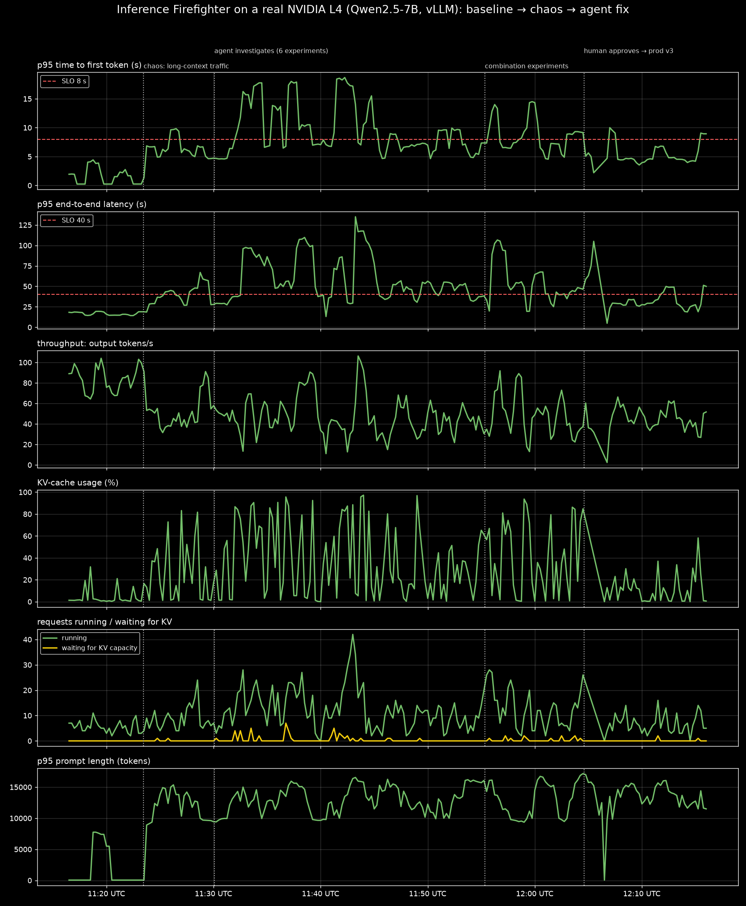

# Inference Firefighter

**An agent that fixes degraded LLM inference: it reproduces the failure on a real GPU, experiments with serving configs in a shadow environment, proves a fix with measurements, and only then asks a human before it restarts the process serving live traffic.**

Built on [TrueForge](https://trueforge.dev) for the *Agents That Act* hackathon (TrueFoundry × Polaris).

## The incident

A team serves **Qwen2.5-7B-Instruct with vLLM on an NVIDIA L4** (Lightning AI Studio on GCP). The config is legal, reviewed, and healthy for weeks of short chat traffic. Then product starts sending long RAG contexts. p95 latency explodes, goodput collapses, and the KV cache fills up. **The config didn't change. The model didn't change. There is no error message.**

The physics: 7B weights take ~15 GB of the 24 GB GPU. What's left for the KV cache holds only tens of thousands of tokens. With 5–11k-token prompts and `max_num_seqs: 256`, vLLM admits far more sequences than the cache can hold; the cache fills, requests wait for KV capacity (older vLLM versions preempt and recompute instead), and the queue grows. Prefix caching is off, so every long request re-prefills the same shared system prompt.

The agent has to measure its way to that diagnosis and to a fix: fewer concurrent sequences, prefix caching, maybe FP8 KV cache (quality-gated). It works by running real experiments on a real GPU, not by recalling defaults.

## How it meets the hackathon requirements

| Requirement | How |
|---|---|
| Runs on TrueForge | Agent `inference-firefighter`: OpenAI model + `inference-ops` MCP server + runbook + sandbox + approvals + subagents + Generative UI |
| Reaches a real system | Real vLLM on real NVIDIA L4 GPUs (Lightning AI on GCP; the AWS `g6` path is also supported), real Prometheus metrics, real engine logs, real `nvidia-smi`, real deploys |
| Generated code runs in a sandbox | The agent's analysis code (percentiles by prompt length, before/after comparisons, charts) runs in a **Daytona** sandbox via Code Mode. The sandbox has no credentials and no route to the fleet. |
| Stops before irreversible actions | `apply_production_config` / `rollback_production` restart the live server. They are gated by TrueForge approval **and** refused server-side unless a shadow experiment of that exact config passed every SLO on recent production traffic. |

**The approval rule, in one line:** *anything reversible runs freely; anything that interrupts a human's traffic stops and asks.*

- **No gate:** telemetry, logs, config reads, and experiments on the shadow GPU. These are reversible with zero blast radius, and gating them would train people to click "approve" without reading.
- **Full gate:** anything that restarts the process serving live traffic. The approval card shows the diff, the evidence run IDs, the justification, the measured blast radius (last restart time, in-flight requests) and the expected before → after numbers.
- **Worst case if the agent is wrong:** a brief restart. Auto-rollback runs if the new engine fails its health check, and `rollback_production` is one approval away.

## Architecture

```
 laptop ──SSM tunnel──▶ CONTROL (AWS t3.large, ap-south-1; no public ports)
                        ├─ TrueForge :8790 (agent, approvals, UI) ──── Daytona sandbox (agent's code)
                        ├─ inference-ops MCP server :8765 (bearer token)
                        ├─ Prometheus :9090
                        └─ chaos tooling (operator only)
                               │ HTTPS + bearer token (Lightning Studio port URLs)
            ┌──────────────────┴──────────────────┐
     ff-prod Studio (GCP, 1 x L4)          ff-shadow Studio (GCP, 1 x L4)
     controller :9000                      controller :9000
     vLLM 0.30 (127.0.0.1:8100)            vLLM 0.30 (127.0.0.1:8100) ← candidate configs
     loadgen = the users + request log     replay harness + quality eval
```
The GPU nodes run on **Lightning AI** because the AWS GPU quota was still under review. The same code
also deploys GPU nodes on AWS (`g6.xlarge`, see "Deploy on AWS" below); the control node accepts either
AWS private IPs or controller URLs.

## A real run, in pictures

**Full gallery with every image and a detailed description: [docs/SCREENSHOTS.md](docs/SCREENSHOTS.md).**

Recorded on 2026-09-26 on the real fleet: Qwen2.5-7B-Instruct on vLLM 0.30, one NVIDIA L4 per node (Lightning AI, GCP), same request rate throughout (0.6 req/s). All numbers come from Prometheus and the agent's own shadow experiments.

| # | What you see | Image |
|---|---|---|
| 1 | **Healthy baseline.** Short chat traffic: p95 TTFT < 5 s, end-to-end ~20 s (well under the 40 s SLO), 80–110 output tokens/s, KV cache mostly < 10%, nothing waiting. Prefix caching is off in the live config | [01](docs/screenshots/01-baseline-healthy.png) |
| 2 | **Chaos: product starts sending long RAG contexts.** Same request rate, prompt length jumps to 12–15K tokens, KV cache spikes to 100%, requests wait for KV capacity, p95 end-to-end climbs past 60 s | [02](docs/screenshots/02-chaos-incident.png) |
| 3 | **The agent triages** in TrueForge: SLOs, policy, change history (no config change), then computes the before/after classification in code in the Daytona sandbox | [03a](docs/screenshots/03a-agent-triage-start.png) |
| 4 | **Hypothesis → measurement → verdict.** Prefix caching alone: "REJECTED as a standalone fix, but directionally positive" (TTFT 17.2 → 11.3 s). FP8 KV alone: "REJECTED… more capacity admitted more concurrent work" | [03](docs/screenshots/03-agent-investigating.png) |
| 5 | **Every experiment on the shadow GPU**, one burst each (KV cache, waiting for KV, prompt length, latency), never touching prod | [03b](docs/screenshots/03b-shadow-experiments.png) |
| 6 | **It refuses to guess.** After six single-lever experiments, none passed every SLO, so it withheld the change: "No safe production change proven… Production was not restarted" | [04](docs/screenshots/04-agent-evidence-no-safe-change.png) |
| 7 | **The on-call engineer extends the budget; the agent consults the Inference Engineering skill** and tests combinations: prefix caching + `max_num_seqs` 16 + `gpu_memory_utilization` 0.95 passes every SLO (TTFT 4.76 s, e2e 33 s, goodput 100%, KV peak 35%). It checks 1.3× headroom and rejects 24 sequences, citing the batching trade-off. Then it **stops and asks**: diff, evidence run, blast radius, Allow / Deny | [05](docs/screenshots/05-approval-request.png) |
| 8 | **Human approves → prod v3.** Healthy in 107.5 s, no rollback; the agent verifies on a clean 3-minute post-restart window: all SLOs pass with ~50% long prompts, KV peak 30%, queue 0, prefix-cache hit rate 30% | [06](docs/screenshots/06-agent-remediation-complete.png), [06a](docs/screenshots/06a-agent-before-after.png) |
| 9 | **The whole timeline in Grafana**: baseline → chaos → experiments → approved fix, with the live config showing prefix caching True, memory 0.95, KV concurrency 1.58× → 2.48× | [07](docs/screenshots/07-full-timeline-prod.png), [07b](docs/screenshots/07b-full-timeline-prod-and-shadow.png) |
| 10 | **One-image summary** (Prometheus): after the fix, p95 TTFT settles around 4–5 s (one brief ~9 s blip), end-to-end around 25–30 s, KV mostly < 30%, and requests waiting for KV stay at zero, under the same long-context traffic that caused the incident | [08](docs/screenshots/08-summary-baseline-chaos-fix.png) |
| 11 | **TrueForge Sessions**: 3 turns, 37 min, 63 tool calls, 0 errors, with the approval (human-in-the-loop) step on the timeline | [09](docs/screenshots/09-trueforge-session-timeline.png) |
| 12 | **Grafana live view, last hour**: the tail of the 1.0 req/s calibration overload (how we found the L4's capacity limit) followed by the demo incident and recovery | [10](docs/screenshots/10-grafana-live-last-hour.png) |



### MCP tools (`inference-ops`)
| Class | Tools |
|---|---|
| Observe (read-only, free) | `get_slo_status`, `compare_windows`, `get_request_log`, `get_engine_metrics`, `query_prometheus`, `get_serving_config`, `get_change_history`, `get_logs`, `get_gpu_status`, `get_policy`, `list_experiments`, `get_experiment`, `plan_production_change`, `wait_for_shadow` |
| Shadow (free, never touches prod) | `capture_workload`, `deploy_shadow`, `run_load_test` (hypothesis required), `run_quality_eval` |
| **Prod (human approval)** | `apply_production_config`, `rollback_production` |

Guardrails live in the server regardless of approval:
- only allowlisted knobs within safe ranges
- the model can't be changed
- shadow tools can't target prod
- `apply_production_config` requires qualifying evidence: a shadow run of this exact config hash that passed every SLO on production traffic captured in the last 90 minutes, at ≥ 1× rate, for ≥ 45 s
- a quality eval is required for any KV-precision change

## API keys and accounts needed

| What | Who provides | Where it goes | Required? |
|---|---|---|---|
| **AWS credentials** | Organizers | Your laptop's AWS CLI only (`aws configure` or SSO), to run `infra/aws/*.sh`. The instances use an IAM role, with no keys on them. | Yes |
| **OpenAI API key** | Organizers | TrueForge UI → Settings → Models → OpenAI | Yes |
| **Daytona API key** | You (daytona.io) | TrueForge UI → Settings → Sandbox providers. The key needs **Sandboxes** access **and Snapshots write**. | Yes |
| **Lightning AI API key** | You (lightning.ai) | `export LIGHTNING_API_KEY=…` in your terminal only (used by `infra/lightning/studio.py`) | Yes, for Lightning GPU nodes |
| Hugging Face read token | You | `HF_TOKEN=… ./infra/aws/secrets.sh` (SSM SecureString) | Recommended (the model is ungated; avoids download rate limits) |
| GitHub fine-grained PAT + repo | You | `GITHUB_TOKEN=… GITHUB_REPO=owner/repo ./infra/aws/secrets.sh` | Optional (commits each approved prod config as an audit trail) |
| Existing Prometheus URL (+ auth) | You | `PROMETHEUS_URL=… ./infra/aws/secrets.sh`, plus `PROMETHEUS_BEARER_TOKEN` in `/etc/firefighter/control.env` | Optional. If unset, a Prometheus is started on the control node. |
| `CONTROLLER_TOKEN`, `MCP_AUTH_TOKEN` | Generated by `secrets.sh` | SSM → instance env files | Automatic |

Keys never go into the repo or the video. The OpenAI and Daytona keys are only ever pasted into TrueForge's settings.

**AWS quota check (do this first):** Service Quotas → EC2 → *Running On-Demand G and VT instances* in **ap-south-1** must be **≥ 8 vCPUs** (2 × g6.xlarge at 4 vCPUs each).

## Deploy: GPU nodes on Lightning AI (current setup)

The control node runs on AWS (steps 1–2 and 4–6 of "Deploy on AWS" below, with `SKIP_GPU=1 ./infra/aws/launch.sh`). The GPU nodes are two Lightning Studios:
```bash
export LIGHTNING_API_KEY=...                        # never commit it
for r in prod shadow; do
  python -m infra.lightning.studio up $r            # GCP, 1 x L4, exposes :9000, saves the URL to infra/lightning/studio.env
  python -m infra.lightning.studio push $r          # code + ~/.ff/node.env (tokens read from AWS SSM)
  python -m infra.lightning.studio setup $r         # vLLM (uv), Qwen2.5-7B weights, dataset, controller, engine (~10 min)
done
python -m infra.lightning.studio logs prod setup    # wait for "SETUP COMPLETE (prod)"
./infra/aws/deploy_code.sh control                  # points the control node + Prometheus at the Studio URLs
python -m infra.lightning.studio stop prod          # stop GPU billing when done (same for shadow)
```
After a Studio restart: `python -m infra.lightning.studio start <role>` brings the controller, engine and traffic back.

## Deploy on AWS (step by step)

Prerequisites on the laptop: AWS CLI v2 + [Session Manager plugin](https://docs.aws.amazon.com/systems-manager/latest/userguide/session-manager-working-with-install-plugin.html), Python 3.10+.

```bash
# 1. Launch 2 x g6.xlarge (prod, shadow) + 1 x t3.large (control) in ap-south-1
AWS_REGION=ap-south-1 ./infra/aws/launch.sh

# 2. Secrets -> SSM Parameter Store (tokens are generated; HF/GitHub/Prometheus optional)
HF_TOKEN=hf_xxx ./infra/aws/secrets.sh

# 3. Ship code + run setup on all nodes (GPU nodes: ~10-20 min for image + weights)
./infra/aws/deploy_code.sh
./infra/aws/ssm.sh prod    'tail -n 20 /var/log/firefighter-setup.log'   # wait for "SETUP COMPLETE (prod)"
./infra/aws/ssm.sh shadow  'tail -n 20 /var/log/firefighter-setup.log'
./infra/aws/ssm.sh control 'tail -n 20 /var/log/firefighter-setup.log'

# 4. Open TrueForge on your laptop (keep this running in its own terminal)
./infra/aws/tunnel.sh            # -> http://localhost:8790
#    In the UI: Settings -> Models -> OpenAI (paste key); Settings -> Sandbox providers -> Daytona (paste key)

# 5. Register the MCP connector + create the agent (model FQN exactly as shown in Settings -> Models)
./infra/aws/ssm.sh control '/opt/firefighter/infra/node/ops.sh register-agent openai/<model-id>'

# 6. Sanity check the tools end to end (shadow only)
./infra/aws/ssm.sh control '/opt/firefighter/infra/node/ops.sh smoke'
```

## Calibration (measured on the real fleet)

Lightning AI, GCP, 1 × NVIDIA L4 per node, Qwen2.5-7B-Instruct, vLLM 0.30. vLLM reports a **KV cache of 51,936 tokens** (about six 8k-token requests at once).

**What the incident looks like on prod** (1 rps; the demo runs at 0.6 rps, below):

| | Healthy (~5% long prompts) | Incident (~50% long prompts) |
|---|---|---|
| p95 TTFT | 2.5 s | 21.9–28.7 s |
| p95 end-to-end | 20.9 s | 137–163 s |
| output tokens/s | 147 | 7 |
| KV-cache usage mean / max | 5% / 22% | 81% / 99% |
| running / waiting for KV capacity | 11 / 0 | 63–95 / up to 15 |
| preemptions | 0 | 0 (vLLM V1 holds requests back instead; see `waiting_for_kv_capacity`) |

**Proving the fix on the shadow L4** (captured incident traffic, 60 s replays; scored with the final SLOs):

| Config | Load | p95 TTFT | p95 e2e | Goodput | Verdict |
|---|---|---|---|---|---|
| production config (`max_num_seqs` 256, no prefix caching) | 0.6 rps | 14.8 s | 54 s | 41% | ❌ incident |
| `max_num_batched_tokens` 16384 ("tempting fix") | 1.0 rps | 15.6 s | 68 s | 15% | ❌ |
| **`max_num_seqs` 16 + `enable_prefix_caching`** | 0.6 rps | **6.8 s** | **28 s** | **100%** | ✅ fix |
| same + `kv_cache_dtype: fp8` | 0.6 rps | 6.7 s | 30 s | 100% | ✅ (needs the quality gate) |
| `max_num_seqs` 16 + prefix caching | 1.0 rps | 9.4 s | 47 s | 74% | ❌ capacity limit: needs more GPUs, not config |

**SLOs** (`mcp_server/policy.yaml`): p95 TTFT ≤ 8 s, p95 end-to-end ≤ 40 s, error rate ≤ 1%, goodput ≥ 90%. On an L4 a single 8–10k-token prefill takes ~3 s, so tighter TTFT targets are unrealistic with long-context traffic. **Scenarios**: `healthy` and `long_context_shift` both run at 0.6 rps (same users, different prompts); `surge` is 1.8 rps.

Operator tools: `python -m chaos.measure <minutes>` (what the agent would see), `bash dev/prove_fix.sh '<changes>' …` on the control node (replay captured prod traffic on shadow under candidate configs; `RATE=0.6` to scale).

## Dashboard (Grafana)

`./infra/aws/tunnel.sh 3000` → http://localhost:3000 (read-only, no login). The "Inference Firefighter: vLLM on L4" dashboard shows, for prod and shadow:
- **What users feel:** p50/p95 TTFT and end-to-end latency, with SLO lines; throughput.
- **Why:** KV-cache usage, running vs waiting (incl. waiting for KV capacity) vs preemptions, prompt-length distribution, prefix-cache hit rate, GPU utilization.
- **The live KV config** as vLLM reports it (prefix caching, cache dtype, memory, blocks).
- **Markers** on every prod/shadow engine restart, so the approved fix and each shadow experiment are visible on the timeline.

The admin password (only needed to edit dashboards) is in `/etc/firefighter/grafana_admin_password` on the control node.

## Running the demo

On the control node (`./infra/aws/ssm.sh control '…'` or an SSM session):

```bash
/opt/firefighter/infra/node/ops.sh chaos reset --clear-evidence /opt/firefighter/state/mcp   # healthy + initial config
# wait ~10 min of healthy traffic (baseline), then:
/opt/firefighter/infra/node/ops.sh chaos traffic long_context_shift                           # the incident
```

In TrueForge, start a chat with `inference-firefighter`:
> Production inference is degraded: p95 latency and goodput alerts are firing. Find the cause, prove a fix, and prepare the remediation.

Expected arc:
1. It triages.
2. It works out *what changed* in code in the sandbox: same rps, prompts much longer, TTFT bad only on long prompts, KV cache pinned, preemptions up, and no config change.
3. It reproduces the problem on shadow.
4. It tests hypotheses, rejecting at least one on evidence.
5. It converges, shows an evidence card, and plans the change.
6. **Approval card**, then prod restarts and recovers, and the agent verifies and reports.

Other scenarios: `surge` (more users), `burst` (transient: the right answer is *no change*).

## Local development (no GPU)

`dev/fake_vllm.py` is a **toy stand-in for plumbing tests only**. It is never used for calibration, evidence, or the demo.

```bash
python3 -m venv .venv && .venv/bin/pip install -r requirements-dev.txt
.venv/bin/python -m pytest -q tests/test_core.py
./dev/run_local_stack.sh start          # fake controllers + loadgen + MCP on :8765
MCP_AUTH_TOKEN=mcptoken .venv/bin/python -m tests.smoke_mcp --quick
./dev/run_local_stack.sh stop
```

To test against a local TrueForge, start it with `OUTBOUND_URL_ALLOWED_HOSTS='["127.0.0.1"]'`, because TrueForge blocks private and loopback MCP URLs by default.

## Verified so far vs still to verify on AWS

- **Verified locally:**
  - MCP server over real streamable HTTP with bearer auth (20 tools, correct read-only/destructive annotations)
  - Guardrail refusals, the evidence-gated apply, auto-rollback bookkeeping
  - Prometheus scraping through the controllers with bearer auth, and PromQL through the MCP server
  - A real TrueForge server registering the connector (it sees all 20 tools and their annotations) and creating the agent with the approval gates
- **Verified on AWS** (TrueForge on the control node, `openai/gpt-5-5`, Daytona; stand-in engine via `dev/aws_wiring_test.sh`):
  - **Code Mode bridge:** the agent's Python script in the Daytona sandbox called `get_request_log` through `call_tool` and computed p95 TTFT by prompt length
  - shadow deploy → load test → evidence → `plan_production_change` (`ready: true`)
  - **approval pause** on `apply_production_config`, with diff, evidence, justification and blast radius in the request
  - **Deny with a reason:** the agent stopped, did not retry, and production was untouched
- **Still to verify on the real GPUs** (waiting on the g6 quota):
  - vLLM flags on the pinned image
  - Real KV-cache exhaustion under `long_context_shift` (calibration)
  - FP8 KV cache quality on L4

`tests/drive_agent.py` runs the agent from a terminal through the TrueForge SDK (rehearsals, wiring tests). It prints every step and stops at approval pauses, so a human decides with `--allow` or `--deny "reason"`.

## Repo layout

```
agent/            instructions.md, create_agent.py (registers connector + agent via trueforge-sdk)
skills/           incident-runbook/SKILL.md (inlined into instructions by default)
mcp_server/       server.py (tools), policy.yaml (SLOs + evidence rules), evidence.py, clients.py, prom.py
controller/       app.py: per-GPU-node service owning the vLLM container, metrics, logs, replay, quality eval
workload/         dataset.py (deterministic prompts), loadgen.py (users), loadtest.py (open-loop replay), scenarios/
common/           vllm_config.py (knob allowlist), stats.py (percentiles, SLOs), promtext.py
chaos/            operator tooling (inject/reset); not reachable by the agent
infra/            aws/ (launch, secrets, deploy, tunnel, teardown), node/ (setup scripts, ops.sh), prometheus/, configs/
dev/              fake_vllm.py + run_local_stack.sh (local plumbing tests only)
tests/            unit tests + MCP smoke test
```

## AI assistance disclosure

Per the hackathon rules: this project was built with help from **Claude Code (Anthropic)**, which was used to draft the architecture, write code and scripts, and write documentation. The team reviewed, ran and tested the code and can explain every component. <!-- Add any other assistants you use (Cursor, Copilot, …) here. -->

## Teardown

```bash
./infra/aws/teardown.sh          # terminate instances
./infra/aws/teardown.sh --all    # also SG, IAM role, code bucket, SSM parameters
```
