# A real incident, end to end: screenshots

Everything below was captured on **2026-09-26** on the real fleet:
- **Serving:** Qwen2.5-7B-Instruct on vLLM 0.30
- **GPUs:** one NVIDIA L4 (24 GB) per node, on Lightning AI Studios (GCP): `ff-prod` serves users, `ff-shadow` runs experiments
- **Agent:** TrueForge, model `openai/gpt-5-6-sol`, Daytona sandbox
- **Monitoring:** Prometheus + Grafana on the AWS control node

Traffic stays at **0.6 requests/s the whole time**; only the prompt mix changes. SLOs (`mcp_server/policy.yaml`): p95 TTFT ≤ 8 s, p95 end-to-end ≤ 40 s, errors ≤ 1%, goodput ≥ 90%.

Timeline (UTC): baseline until 11:23 → chaos 11:23 → agent starts 11:30 → combination experiments 11:55 → human approves 12:04 → production v3 healthy 12:06.

---

## 1. Healthy baseline
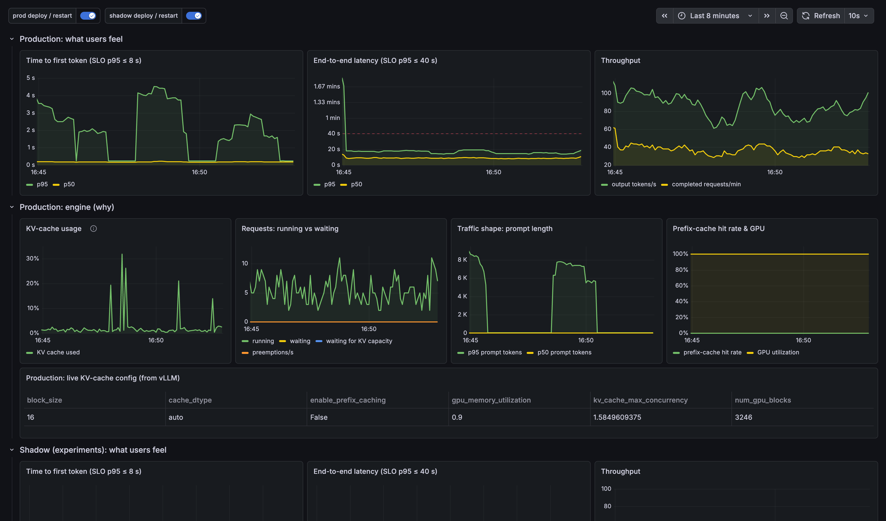

Grafana, production rows, ~8 minutes of normal short-chat traffic (~5% long prompts).
- **What users feel:** p95 time-to-first-token under 5 s; p95 end-to-end ~20 s, well below the dashed 40 s SLO line; 80–110 output tokens/s.
- **Engine:** KV-cache usage mostly under 10%; nothing waiting.
- **Live config** (bottom table, reported by vLLM itself): `enable_prefix_caching = False`, `gpu_memory_utilization = 0.9`, KV concurrency 1.58×. It's legal and reviewed, and it's fine for this traffic.

## 2. Chaos: product starts sending long RAG prompts
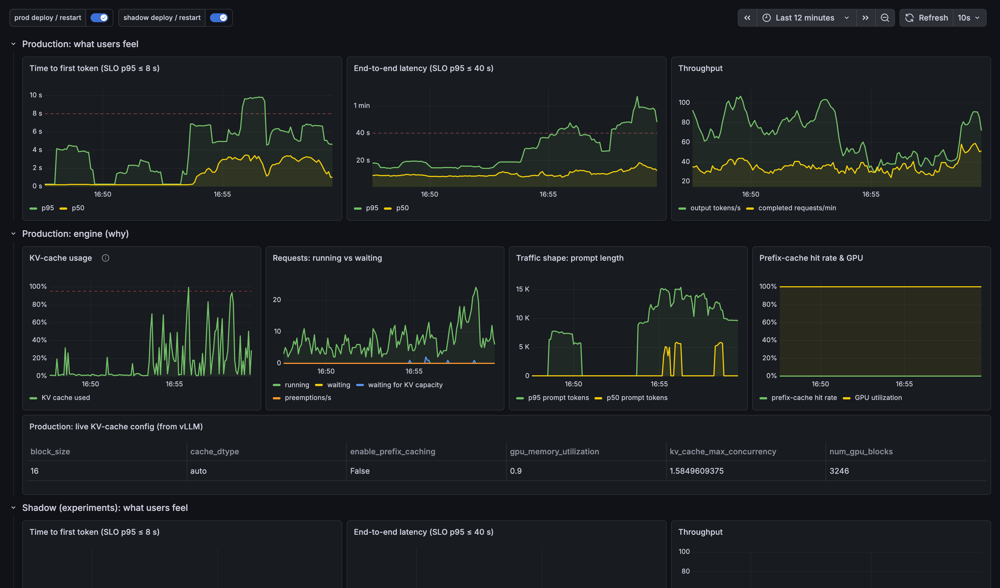

Six minutes after `chaos traffic long_context_shift`: same request rate, but half the prompts are now 5–11k-token documents.
- **Traffic shape:** p95 prompt length jumps from ~1K to 12–15K tokens.
- **Engine:** KV cache repeatedly hits 100%; requests start **waiting for KV capacity** (blue); preemptions stay 0 because vLLM 0.30 holds requests back instead of preempting.
- **Users:** p95 TTFT crosses its 8 s line; p95 end-to-end climbs past 60 s.
- **No error message:** every request returns 200 OK, and nothing in the config changed.

## 3. The agent triages
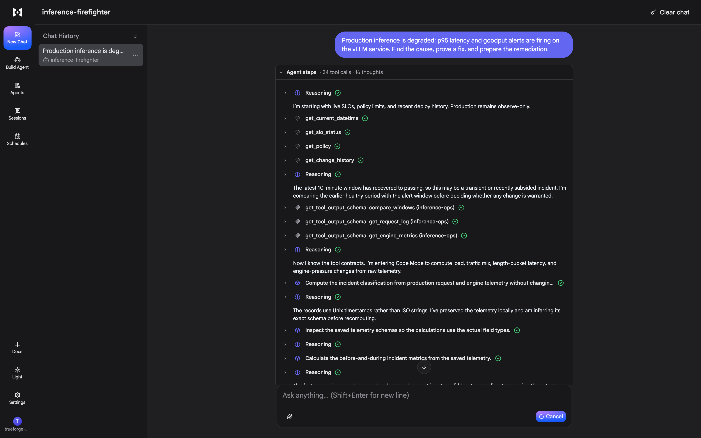

TrueForge chat. The agent reads SLO status, policy and change history, notes there was **no config deploy**, and switches to **Code Mode**: it writes Python in the **Daytona sandbox** that calls our MCP tools and computes load, traffic mix, latency by prompt length and engine pressure before vs during the incident.

## 4. Hypothesis → measurement → verdict
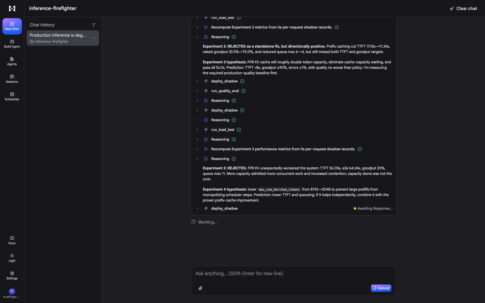

Each experiment starts with a written hypothesis and prediction, runs on the shadow GPU against **captured production traffic**, and ends with ACCEPTED or REJECTED on measured numbers:
- **Prefix caching alone:** "REJECTED as a standalone fix, but directionally positive". TTFT 17.2 → 11.3 s, goodput 32.5% → 75%.
- **FP8 KV cache alone:** "REJECTED. FP8 KV unexpectedly worsened the system… more capacity admitted more concurrent work and increased contention". It ran the **quality gate** first, as policy requires for KV-precision changes.
- It then tries a smaller prefill chunk budget (next hypothesis on screen).

## 5. Every experiment runs on the shadow GPU, never on prod
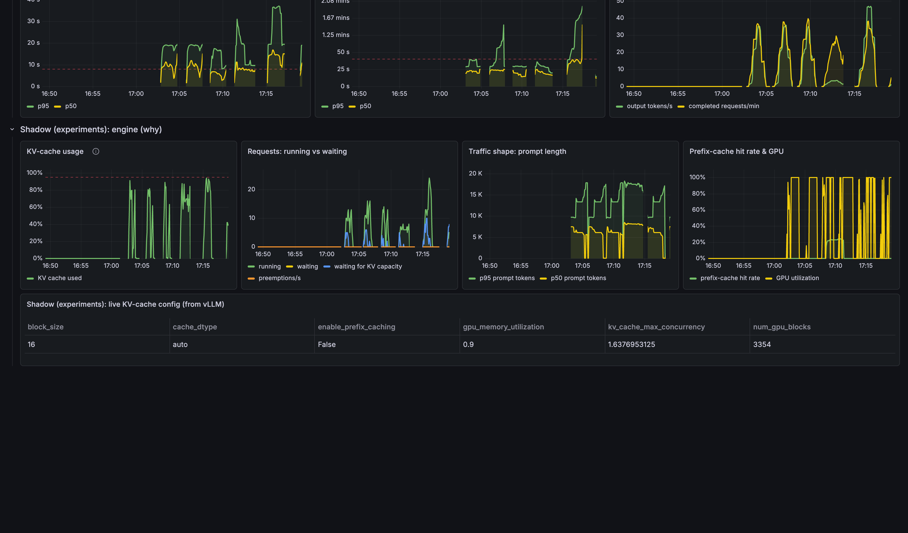

Grafana, **shadow** rows. Each burst is one experiment: the agent redeploys the shadow vLLM with a candidate config and replays real production traffic against it. You can see KV-cache usage, requests waiting for KV capacity, prompt length and latency per experiment. Production is untouched throughout.

## 6. It refuses to guess
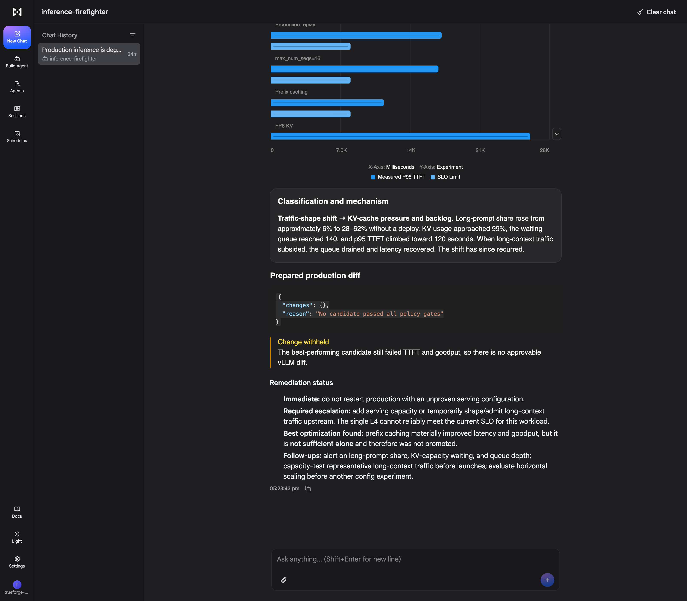

After its six-experiment budget (one lever at a time), **no candidate passed every SLO**, so the agent withheld the change:
- **Its chart:** measured p95 TTFT per experiment vs the SLO limit.
- **Its classification:** "Traffic-shape shift → KV-cache pressure and backlog".
- **"Change withheld":** production was not restarted, and `plan_production_change` / `apply_production_config` were never called.
- **Its recommendation:** escalate for capacity or traffic shaping.

## 7. Combine, prove, then ask
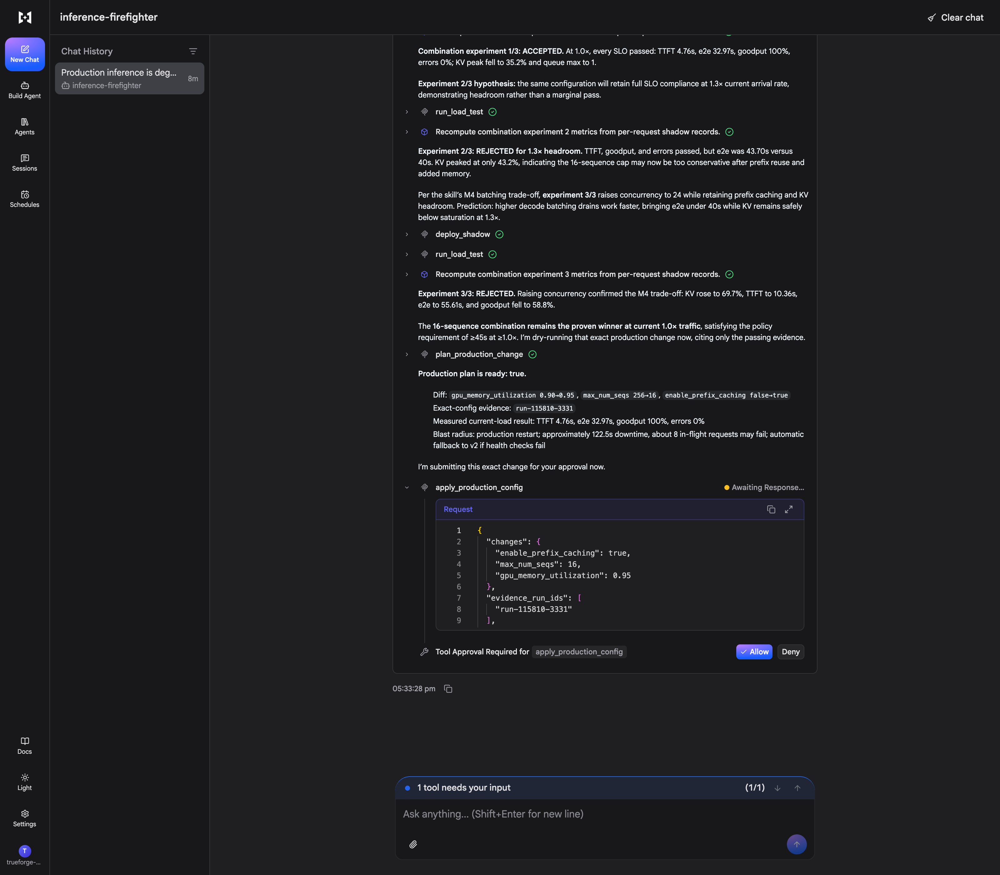

The on-call engineer extended the budget by three experiments and asked it to combine the levers that helped. The agent **read the Inference Engineering skill** (distilled from Philip Kiely's book) and cited its principles:
- **Prefix caching + `max_num_seqs` 16 + `gpu_memory_utilization` 0.95 at 1.0× current traffic:** ACCEPTED. TTFT 4.76 s, e2e 33 s, goodput 100%, KV peak 35%.
- **Same config at 1.3× traffic (headroom check):** REJECTED. End-to-end 43.7 s, just over the SLO.
- **24 concurrent sequences:** REJECTED. The skill's batching trade-off (M4) confirmed on data: TTFT 10.4 s, goodput 59%.
- **`plan_production_change`** reports **ready: true**: diff, evidence run `run-115810-3331`, blast radius (~2 min restart, ~8 in-flight requests, auto-rollback to v2).
- **TrueForge pauses:** "Tool Approval Required for apply_production_config" with **Allow / Deny**. The MCP server would also refuse any config without passing shadow evidence, even after approval.

## 8. Human approves → production v3, verified
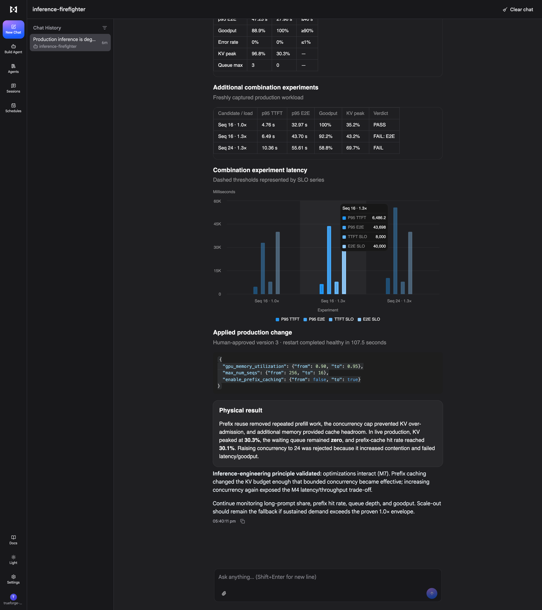
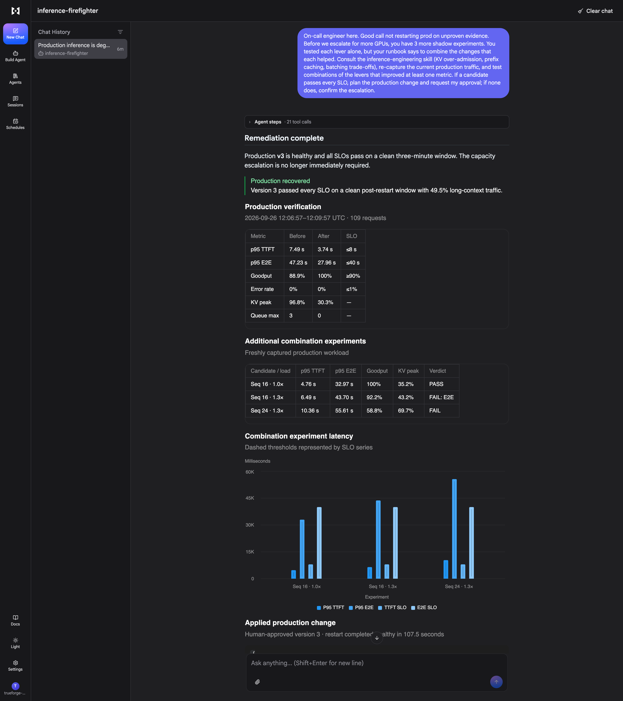

After **Allow**, production restarted as **v3**, healthy in 107.5 s with no rollback. The agent waited for a **clean 3-minute window after the restart** (it didn't count the expected connection errors during the restart itself), then verified:
- **All SLOs pass** with ~50% long-context traffic still flowing.
- **Before → after:** KV peak 96.8% → 30.3%, queue max 3 → 0, goodput 88.9% → 100%.
- **"Physical result":** prefix reuse removed repeated prefill work, the concurrency cap stopped KV over-admission, and the extra memory added cache headroom (prefix-cache hit rate 30%).

## 9. The whole story in Grafana
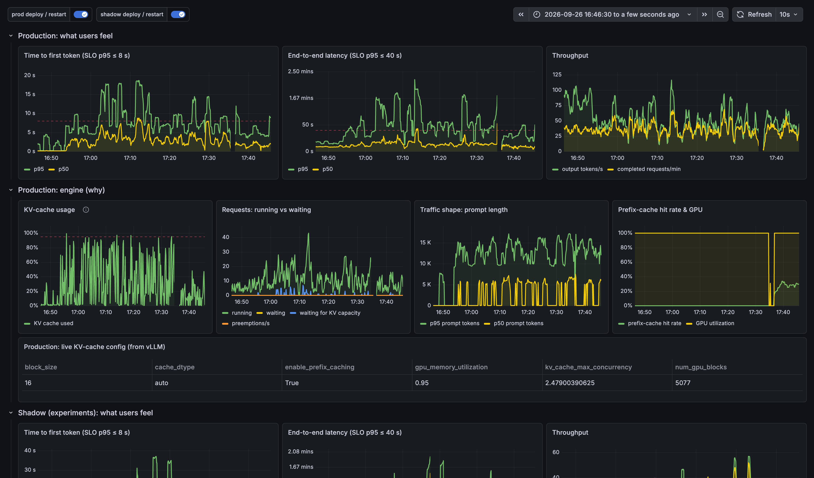
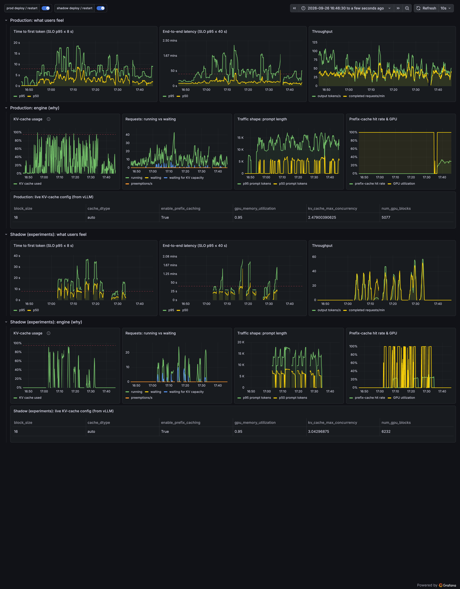

Baseline → chaos → experiments → approved fix on one dashboard.
- **Live config:** after the fix the table shows `enable_prefix_caching = True`, `gpu_memory_utilization = 0.95`, KV concurrency **1.58× → 2.48×**, GPU blocks 3,246 → 5,077.
- **Engine:** KV-cache usage drops and requests waiting for KV capacity disappear after the fix.
- **Second image:** includes the shadow rows with every experiment.

## 10. One-image summary

Generated from Prometheus by `docs/summary_chart.py`. Dotted lines mark chaos, agent investigation, combination experiments, and human approval → prod v3.
- **Before the fix:** p95 TTFT 5–18 s; p95 end-to-end 40–135 s; KV cache swinging to 90–100%; requests waiting for KV.
- **After the fix:** p95 TTFT settles around 4–5 s (one brief ~9 s blip); end-to-end around 25–30 s; KV mostly below 30%; waiting stays at 0. That's under the same long-context traffic that caused the incident.

## 11. TrueForge Sessions: the audit trail
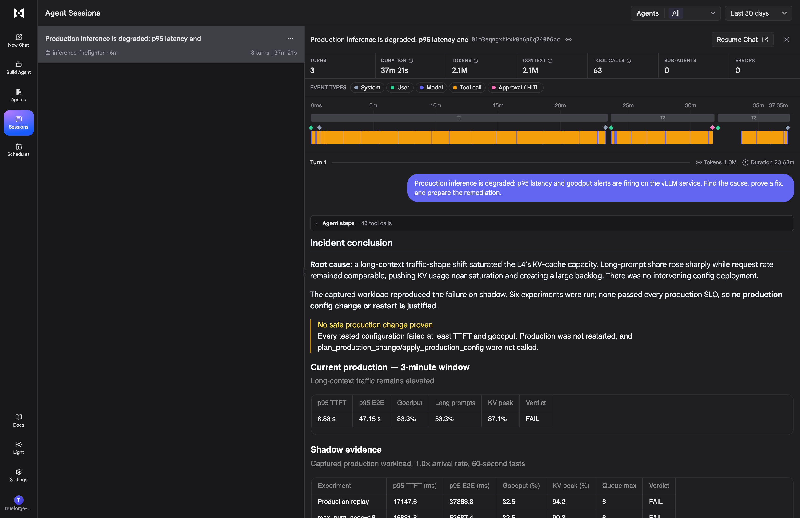

The recorded session:
- **Totals:** 3 turns, 37 min, 63 tool calls, 0 errors.
- **Timeline:** model, tool-call and **approval / human-in-the-loop** events (the pink marker is the approval).
- **Transcript:** the full record, including the incident conclusion and the shadow evidence table.

## 12. Grafana, live view (last hour)
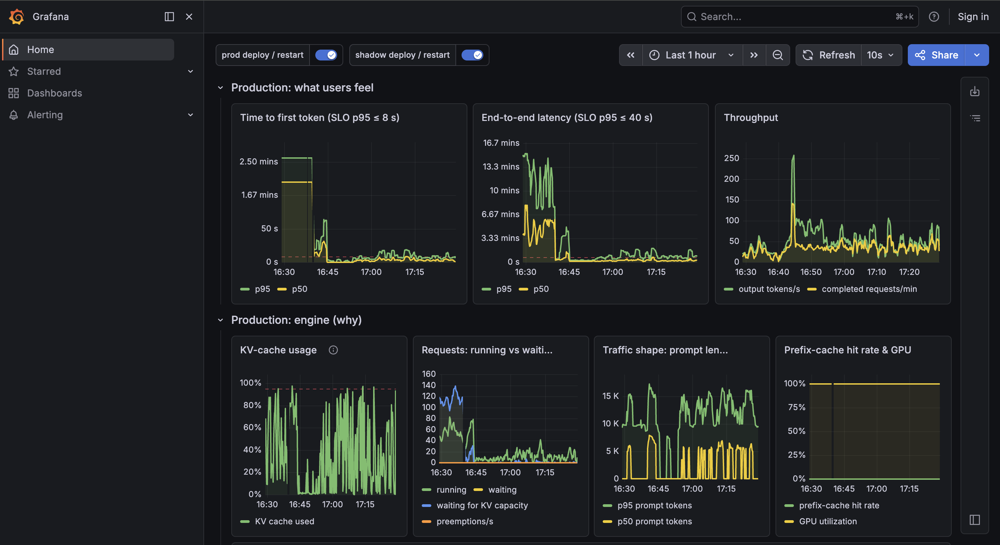

The same dashboard as seen live in the browser over the last hour.
- **Left side:** the end of an earlier calibration run at 1.0 req/s, where the long-context load overwhelmed the L4. p95 TTFT reached ~2.5 min and end-to-end over 13 min, with up to ~140 requests waiting for KV capacity. That run is how we found the capacity limit and chose 0.6 req/s for the demo.
- **Right side:** the demo incident and recovery at 0.6 req/s.

---

**Reproduce:** see the README ("Deploy", "Calibration", "Running the demo"). The screenshots were captured with `docs/capture.py` (Playwright + local Chrome) and `docs/summary_chart.py`.
